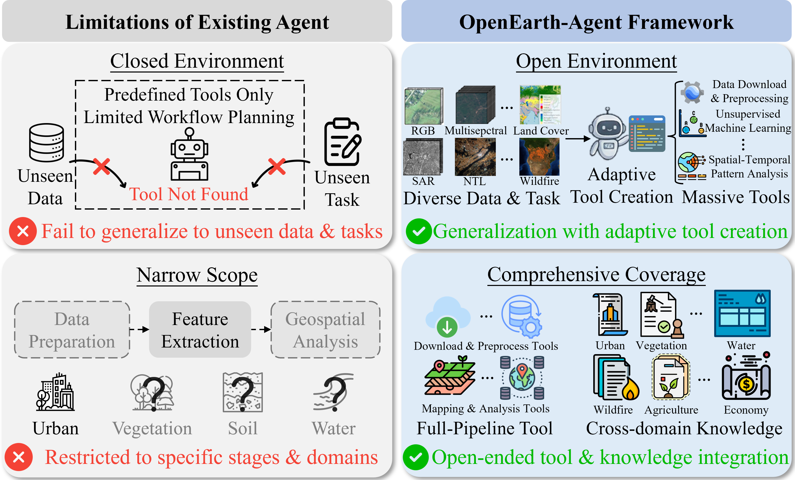

    <h2>
        OpenEarth-Agent: From Tool Calling to Tool Creation for Open-Environment Earth Observation
    </h2>

 

  

 

  <a href="https://arxiv.org/pdf/2603.22148">
    arXiv
  </a>
      
  <a href="resources/OpenEarth_Agent_arxiv.pdf">
    PDF
  </a>

 
 

<!-- 

 -->

<!-- 

English | [简体中文](README_Chinese.md)

 -->

## Introduction

The repository for this project is the code implementation of the paper OpenEarth-Agent: From Tool Calling to Tool Creation for Open-Environment Earth Observation [https://arxiv.org/pdf/2603.22148](ARXIV).

If you find this project helpful, please give us a star ⭐️.

Main Contribution

- We propose OpenEarth-Agent, the first remote sensing agent architecture designed for open environments. By performing adaptive workflow planning and tool creation conditioned on data and task contexts, OpenEarth-Agent accommodates diverse EO data and tasks. Through multi-stage tool and cross-domain knowledge integration, it effectively executes full-pipeline EO across multiple application domains.

- We construct OpenEarth-Bench, the first remote sensing agent benchmark oriented towards open environments. Comprising $596$ full-pipeline cases sourced from real-world applications across various domains, it serves as a robust platform for evaluating agent performance in open environments.

- Extensive experiments on OpenEarth-Bench and cross-benchmark evaluations on Earth-Bench validate the effectiveness of OpenEarth-Agent. Notably, on Earth-Bench, OpenEarth-Agent demonstrates the ability to create functionally equivalent professional tools, and in certain instances, tools with superior data adaptability. Operating with merely $6$ integrated tools, it achieves performance comparable to agents utilizing full tool calling, and significantly outperforms existing agents when provided with the complete toolset.

## Updates

## TODO

- [] Open source the model code
- [] Open source the Benchmark

## License

This project is licensed under the [Apache 2.0 License](LICENSE)。
